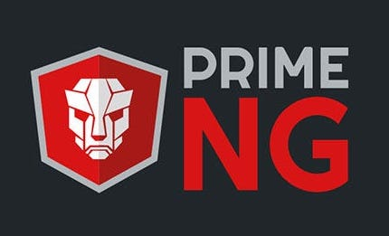

<a name="readme-top"></a>

<br />
<div align="center">
  <a href="https://primeng.org">
    
  </a>

  <h3 align="center">Angular PrimeNg Template</h3>

  <p align="center">
    An awesome Project boilerplate / template to jumpstart your projects using Angular & primeNg!
    <br />
    <a href="https://primeng.org"><strong>Explore the docs »</strong></a>
    <br />
    <br />
    <a href="https://primeng.org/installation">Installation </a>
    ·
     <a href="https://blocks.primeng.org">View Demo</a>
    ·
    <a href="https://github.com/orgs/primefaces/discussions">Forum / Disscussion</a>
  </p>
</div>

<details>
  <summary>Table of Contents</summary>
  <ol>
    <li>
      <a href="#about-the-project">About The Project</a>
      <ul>
        <li><a href="#built-with">Built With</a></li>
      </ul>
    </li>
    <li>
      <a href="#getting-started">Getting Started</a>
      <ul>
        <li><a href="#prerequisites">Prerequisites</a></li>
        <li><a href="#installation">Installation</a></li>
      </ul>
    </li>
    <li><a href="#usage">Usage</a></li>
    <li><a href="#roadmap">Roadmap</a></li>
    <li><a href="#contributing">Contributing</a></li>
    <li><a href="#license">License</a></li>
    <li><a href="#contact">Contact</a></li>
  </ol>
</details>

## About The Project

[![Product Name Screen Shot][product-screenshot]](https://example.com)

There are many great Angular Boostraping with PrimeNg templates available on GitHub; however, I didn't find one that really suited my needs so I created this enhanced one. I want to create a Angular Boostraping with PrimeNg template so amazing that it'll be the last one you ever need.

Here's why:
* Your time should be focused on creating something amazing. A project that solves a problem and helps others
* You shouldn't be doing the same tasks over and over like creating a Angular Boostraping with PrimeNg from scratch
* You should implement DRY principles to the rest of your life :smile:

Of course, no one template will serve all projects since your needs may be different. So I'll be adding more in the near future. You may also suggest changes by forking this repo and creating a pull request or opening an issue. Thanks to all the people have contributed to expanding this template!

Angular Version CLI :
[![Angular CLI version informations][angular-cli]](https://example.com)


* See the repo below :
  ```sh
  Use the `https://github.com/sabidev2021/angular-prime-template` to get started.
  ```

<p align="right">(<a href="#readme-top">back to top</a>)</p>

### Built With

This section should list any major frameworks/libraries used to bootstrap your project. Leave any add-ons/plugins for the acknowledgements section. Here are a few examples.

* [![Angular][Angular.io]][Angular-url]

<p align="right">(<a href="#readme-top">back to top</a>)</p>

## Getting Started

This is an example of how you may give instructions on setting up your project locally.
To get a local copy up and running follow these simple example steps.

### Prerequisites

This is an example of how to list things you need to use the software and how to install them.
* npm
  ```sh
  npm install npm@latest -g
  ```

### Installation

_Below is an example of how you can instruct your audience on installing and setting up your app. This template doesn't rely on any external dependencies or services._

1. Clone the repo
   ```sh
   git clone https://github.com/your_username_/Project-Name.git
   ```
2. Install NPM packages
   ```sh
   npm install
   ```
3. Check your environment target your API in `src/environtments/` and package.json
   ```json
    "ng": "ng",
    "start": "ng serve",
    "start:dev": "ng serve --configuration development",
    "start:staging": "ng serve --configuration staging",
    "build": "ng build",
    "build:dev": "ng build --configuration development",
    "build:staging": "ng build --configuration staging",
    "build:production": "ng build --configuration production --stats-json",
    "watch": "ng build --watch --configuration development",
    "test": "ng test"
   ```

<p align="right">(<a href="#readme-top">back to top</a>)</p>

## Usage

Use this space to show useful examples of how a project can be used. Additional screenshots, code examples and demos work well in this space. You may also link to more resources.

_For more examples, please refer to the [Documentation](https://example.com)_

<p align="right">(<a href="#readme-top">back to top</a>)</p>


## Roadmap

- [x] Add Changelog
- [x] Add back to top links
- [ ] Add library UI Angular PrimeNg integrations and installations
- [ ] Add Continues Integration & Auto merge using github actions
- [ ] Add Additional Templates w/ Examples
- [ ] Add "components" document to easily copy & paste sections of the projects (PRIME-NG Sample)
- [ ] Multi-language Support
    - [ ] Indonesia
    - [ ] English

See the [open issues](https://github.com/othneildrew/Best-README-Template/issues) for a full list of proposed features (and known issues).

<p align="right">(<a href="#readme-top">back to top</a>)</p>

## Contributing

Contributions are what make the open source community such an amazing place to learn, inspire, and create. Any contributions you make are **greatly appreciated**.

If you have a suggestion that would make this better, please fork the repo and create a pull request. You can also simply open an issue with the tag "enhancement".
Don't forget to give the project a star! Thanks again!

1. Fork the Project
2. Create your Feature Branch (`git checkout -b feature/AmazingFeature`)
3. Commit your Changes (`git commit -m 'Add some AmazingFeature'`)
4. Push to the Branch (`git push origin feature/AmazingFeature`)
5. Open a Pull Request

<p align="right">(<a href="#readme-top">back to top</a>)</p>

<!-- LICENSE -->
## License

Distributed under the MIT License. See `LICENSE.txt` for more information.

<p align="right">(<a href="#readme-top">back to top</a>)</p>

## Contact

Dimas Prasetyo - [@linkedin](https://www.linkedin.com/in/dimas-prasetyo) - dimasprasetyo485@gmail.com

Project Link: [https://github.com/sabidev2021/angular-prime-template](https://github.com/sabidev2021/angular-prime-template)

<!-- https://www.markdownguide.org/basic-syntax/#reference-style-links -->
[product-screenshot]: images/screenshot.png
[angular-cli]: images/angular-cli.png
[Angular.io]: https://img.shields.io/badge/Angular-DD0031?style=for-the-badge&logo=angular&logoColor=white
[Angular-url]: https://angular.io/
